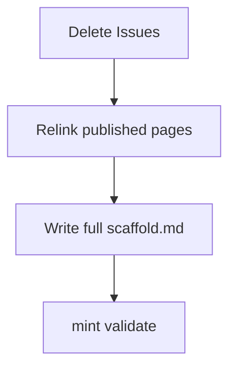

# Scaffold focus: drop Issues, full greenfield brief

**Do not revert Stack pages to Mintlify.** Their content is recovered from git (`git show HEAD:stack/overview.mdx`, `git show HEAD:stack/tooling.mdx`) and moves into [`.notes/scaffold.md`](.notes/scaffold.md), the one-shot brief for the empty mono repo. Mintlify stays the constitution (Structure, Types, Jobs).

**Core principle the user confirmed:** scaffold the *foundation* only. Domain modules (`lib/<module>/` with real names) are **not** created; they are described in the docs/constitution and arrive only through spec-driven issues. The scaffold makes that enforcement real from commit one: `AGENTS.md` contract + `.specify/memory/constitution.md` + `/speckit.*` wired, so no feature ships without a spec.

**Canonical app names:** `apps/web` (product), `apps/test` (internal).

---

## 1. Remove Issues

- Delete [method/issues.mdx](method/issues.mdx); remove empty `method/` dir
- [docs.json](docs.json): Getting started → `["index", "quickstart"]`

## 2. Relink surviving pages

**[index.mdx](index.mdx)**: `apps/testing` → `apps/test`; Navigate drops Issues; cards → Quickstart, Structure, Types, Jobs.

**[quickstart.mdx](quickstart.mdx)**: drop Issues card (Explore: Structure, Types, Jobs). Add one line at top of `## Run the app`: steps apply once the mono repo matches [Structure](/architecture/structure).

**[AGENTS.md](AGENTS.md)**: intro/Symmetry/Content boundaries → architecture doctrine only.

## 3. Minor [architecture/structure.mdx](architecture/structure.mdx) fix

Align `test/` tree indentation (line 16). Nothing else.

---

## 4. [`.notes/scaffold.md`](.notes/scaffold.md), the complete brief

Not in Mintlify nav. Paste into the bare repo (after `bunx create-turbo@latest`) and run the agent. Sections:

### A. Target shape

The three Structure trees (Apps, App, Lib) + Rules table, verbatim from [architecture/structure.mdx](architecture/structure.mdx). Lib tree is a **template**: `<module>` folders are never scaffolded by hand, they arrive via specs.

**Doc-conform rule (applies to every section):** each scaffold.md section opens with its official doc link, and the agent is instructed to follow that doc when any detail is ambiguous. Nothing invented; the file only pins our choices (names, ports, which mode).

### B0. Phase 0: bootstrap from an empty folder

The agent starts with **nothing**, not even a Next.js app. Exact commands, in order:

1. `bunx create-turbo@latest .` (bun as package manager) per [create-turbo](https://turborepo.dev/docs/getting-started/installation), which scaffolds `apps/web`, `apps/docs`, `packages/ui`, `packages/eslint-config`, `packages/typescript-config`
2. Rename `apps/docs` → `apps/test` (update `package.json` name, `microfrontends.json`, `basePath: "/test"`)
3. Remove `packages/eslint-config`; replace with root oxlint + prettier per the [Oxc guide](https://turborepo.dev/docs/guides/tools/oxc) (root `//#lint` task)
4. Re-init `packages/ui` with `bunx shadcn@canary init` (monorepo option) per the [shadcn guide](https://turborepo.dev/docs/guides/tools/shadcn-ui); add Tailwind v4 via `@repo/tailwind-config`
5. Add `@repo/vitest-config` package; wire per-package `test` scripts
6. `git init` + first commit before any customization, so every later step is a reviewable diff

Every subsequent section states its own install commands (`bun add …` / `bun add -d …` per workspace) so the agent never guesses package names.

### B. Workspace layout (Turborepo-idiomatic)

Per the [Turborepo Next.js guide](https://turborepo.dev/docs/guides/frameworks/nextjs) and tool guides, shared config lives in internal packages:

```text
apps/
  web/                      Next.js 16, App Router, default MFE host
  test/                     Next.js 16, own proxy.ts + auth boundary
packages/
  ui/                       shadcn components (bunx shadcn@canary init, monorepo option)
  typescript-config/        @repo/typescript-config: base.json, nextjs.json, react-library.json
  tailwind-config/          @repo/tailwind-config: Tailwind v4 shared-styles.css + postcss export
  vitest-config/            @repo/vitest-config: shared test config (per-package caching model)
lib/                        domain layer, no modules yet (specs create them)
  shared/                   events.ts, db.ts, inngest.ts, gateway.ts stubs
specs/                      spec-kit artifacts land here
.specify/                   memory/constitution.md + templates
turbo.json
```

Key idioms to state:
- `@repo/typescript-config` per the [TypeScript guide](https://turborepo.dev/docs/guides/tools/typescript): `base.json` with `strict`, `noUncheckedIndexedAccess`, `NodeNext`; each package has own `tsconfig.json` extending it; **no root tsconfig**; `check-types` task with topo transit node; no Project References.
- `@repo/tailwind-config` per the [Tailwind guide](https://turborepo.dev/docs/guides/tools/tailwind): Tailwind v4, CSS `@theme` tokens, `ui:` prefix in the UI package, postcss export.
- `packages/ui` via [`shadcn@canary init`](https://turborepo.dev/docs/guides/tools/shadcn-ui) monorepo option; components added from inside an app, CLI routes them to `packages/ui`.
- Node subpath `imports` (`#*`) over tsconfig `paths`.

**Microfrontends, verified against the [guide](https://turborepo.dev/docs/guides/microfrontends):** `microfrontends.json` lives in `apps/web` (the default app, no `routing` key) with `$schema: "https://turborepo.dev/microfrontends/schema.json"`; `test` routes `["/test", "/test/:path*"]`; each app's dev script is `next dev --port $(turbo get-mfe-port)`; `apps/test/next.config.ts` sets `basePath: "/test"`; proxy serves everything on `localhost:3024`. No SPA `<Link>` across apps.

### C. Tasks (turbo.json) per official tool guides

| Task | Model | Source |
| --- | --- | --- |
| `lint` / `format` | Root tasks `//#lint`, `//#format` running oxlint + oxfmt/prettier | [Oxc guide](https://turborepo.dev/docs/guides/tools/oxc) |
| `check-types` | Per-package `tsc --noEmit` with topo transit | [TypeScript guide](https://turborepo.dev/docs/guides/tools/typescript) |
| `test` / `test:watch` | Per-package Vitest (`vitest run`), watch persistent + uncached, shared `@repo/vitest-config` | [Vitest guide](https://turborepo.dev/docs/guides/tools/vitest) |
| `e2e` | Playwright package per app (`@repo/playwright-web`, `@repo/playwright-test`), `dependsOn: ["^build"]`, `passThroughEnv: ["PLAYWRIGHT_*"]` | [Playwright guide](https://turborepo.dev/docs/guides/tools/playwright) |
| `dev` | Microfrontends proxy + both apps, persistent | [Microfrontends](https://turborepo.dev/docs/guides/microfrontends) |

### D. API: idiomatic Hono

Per [Hono best practices](https://hono.dev/docs/guides/best-practices):
- No controllers; handlers written inline after path definitions.
- Each future module's `router.ts` exports a **chained** Hono app (`new Hono().get(...).post(...)`) so [RPC types](https://hono.dev/docs/guides/rpc) flow; export `AppType`.
- Apps mount with `app.route('/<module>', router)` inside `app/api/[[...route]]/route.ts` using [`hono/vercel`](https://hono.dev/docs/getting-started/vercel)'s `handle(app)` exported for each HTTP method, with `basePath('/api')`.
- Zod validation via `@hono/zod-validator`; the typed `hc<AppType>` client lives in `lib/shared/` for the apps to consume.

### D2. Empty but wired: no example module, no example components

**No `lib/<module>/` is scaffolded.** The canonical module template lives in the docs (Structure/Types/Jobs) and is enforced through `.specify/memory/constitution.md`; modules only ever arrive via approved specs. Scaffolding an example would duplicate the constitution and add maintenance.

**Apps stay content-empty:** one `(app)/home/page.tsx` per app containing `return null;` only. No `_components/`, no `_lib/`, no extra components; those directories appear when features do.

**API wiring proof without a module:** the `app/api/[[...route]]/route.ts` catch-all mounts a bare Hono app with one inline `GET /health` returning `{ ok: true }`, enough to prove the Vercel adapter and `basePath('/api')` wiring. No router file in `lib/`.

**Infrastructure wiring (all present, all empty of content):**
- `lib/shared/`: `events.ts` (empty zod registry), `db.ts` (Drizzle client against `DATABASE_URL` placeholder), `inngest.ts` (client), `gateway.ts` (stub)
- `app/api/inngest/route.ts` serve handler in `web` per [Inngest Next.js](https://www.inngest.com/docs/getting-started/nextjs-quick-start), serving zero functions
- Root `drizzle.config.ts` + `db:generate`/`db:migrate` scripts per [Drizzle kit](https://orm.drizzle.team/docs/kit-overview) against the PlanetScale env placeholder
- One trivial smoke test (e.g. in `lib/shared/`) so `turbo run test` proves the Vitest wiring

### E. Auth: WorkOS AuthKit + proxy.ts (verified against [AuthKit Next.js](https://workos.com/docs/user-management/nextjs))

- [`@workos-inc/authkit-nextjs`](https://workos.com/docs/user-management/nextjs) in both apps. The doc confirms Next 16 renamed middleware to **`proxy.ts`**; use the complete `authkitMiddleware` in **middleware-auth mode** (all routes protected by default, allow-list exceptions), matching our "own gate per app" doctrine.
- `AuthKitProvider` wraps each app's root layout (required per doc).
- Callback: `app/callback/route.ts`, matching `NEXT_PUBLIC_WORKOS_REDIRECT_URI` and the dashboard Redirects config.
- Sign-in endpoint: `app/login/route.ts` generating the AuthKit authorization URL server-side (doc pattern); **hosted AuthKit UI, Google OAuth only**, no email+password (dashboard: enable Google, disable password). Configure Sign-out redirect in dashboard (logout errors without it).
- `.env.example`: `WORKOS_API_KEY`, `WORKOS_CLIENT_ID`, `WORKOS_COOKIE_PASSWORD` (32+ chars, `openssl rand -base64 32`), `NEXT_PUBLIC_WORKOS_REDIRECT_URI` (public prefix needed for edge/proxy config).
- Session access via `withAuth` (server) / `useAuth` (client). FGA deferred; sessions only at scaffold time.

### F. Dependency inventory (recovered from stack/overview)

Product: Next.js 16, Hono, shadcn/ui, WorkOS, Drizzle + PlanetScale, Zod, Inngest, Vercel AI SDK, AI Gateway, Pipedream Connect, Cloudflare R2, LlamaParse, Vercel hosting. Tools: Bun, oxlint + prettier (or oxfmt), Vitest, Playwright, spec-kit. Table with one-line role + doc link each. Install now: everything buildable without external accounts. Stub with env placeholders: PlanetScale/Drizzle client, Inngest client, R2, AI Gateway. Do not install yet: Pipedream, LlamaParse.

### G. Agent workbench + spec-driven enforcement (recovered from stack/tooling)

- `.cursor/mcp.json`: Mintlify MCP (this docs hub) + [Linear MCP](https://linear.app/docs/mcp).
- Skills pinned via `skills-lock.json` (`npx skills add ...`).
- spec-kit: `specify init . --integration cursor-agent` (needs [uv](https://docs.astral.sh/uv/)); all `/speckit.*` commands listed.
- Root `AGENTS.md` contract (the enforcement, from day one):
  - No feature work without `specs/NNN-*/spec.md`; first action on a missing spec is `/speckit.specify`
  - `.specify/memory/constitution.md` mirrors the docs Architecture pages
  - Agents file issues to Linear via MCP
  - New `lib/<module>/` folders only via an approved spec
- Seed the constitution: first `/speckit.constitution` run transcribes Structure Rules + Types + Jobs from bonafiai/docs.

### H. Repo hygiene (the forgotten bits)

- Root `package.json`: `"packageManager": "bun@<version>"`, `engines`, workspaces globs, root scripts mapping to `turbo run *`.
- `.gitignore` (Next.js, Turborepo `.turbo/`, coverage, `.env*.local`), `.env.example` committed.
- CI stub: one GitHub Actions workflow running `turbo run lint check-types test` (e2e later); deterministic, key-free; [Turborepo CI guide](https://turborepo.dev/docs/guides/ci-vendors/github-actions) with remote caching noted as opt-in later.
- `README.md`: one paragraph + link to docs site; no duplicated doctrine.
- Vercel: two projects (web, test), [Vercel microfrontends](https://vercel.com/docs/microfrontends) for production routing (Turborepo proxy is local-only; same `microfrontends.json` schema is compatible per the guide).
- Editor/agent baseline: `.cursor/rules/` empty placeholder or none, `.nvmrc` unnecessary with Bun pinned via `packageManager`.

### H2. Acceptance checks (agent runs at the end)

1. `bun install` clean
2. `turbo dev` → `localhost:3024` serves web, `/test` serves test app
3. Both apps redirect to AuthKit sign-in (Google) when unauthenticated
4. `curl localhost:3024/api/health` returns `{ ok: true }` from the inline Hono route
5. `/home` renders (null) in both apps
6. `turbo run lint check-types test` green (one smoke test proves Vitest wiring)
7. `turbo run e2e` runs the placeholder Playwright spec
8. `/speckit.constitution` available in Cursor chat; `.specify/memory/constitution.md` seeded
9. Creating `lib/foo/` without a spec is called out by `AGENTS.md` contract (manual check)

### H3. Ready for the extraction pipeline

State explicitly in scaffold.md's closing: the first real specs are the extraction pipeline stages (source upload → parse → … → commit, see the docs repo's pipeline notes). The foundation is done when a colleague can open Cursor, describe stage 1 as an issue, and run the spec-kit loop with zero setup questions. Nothing pipeline-specific is scaffolded; `lib/` holds only `shared/` until specs land.

### I. Explicit deferrals

All domain modules (constitution-gated, spec-driven only), any Drizzle schema or migrations, any Inngest functions (serve route ships empty), example components, WorkOS FGA, R2 buckets, Pipedream, LlamaParse, Linear issue template, coverage merging, `converge` tooling.

---

## 5. Verify

- `npx mint validate`; no `/method/issues` or `apps/testing` in published MDX
- Five Mintlify pages; `.notes/scaffold.md` complete enough to hand to an agent in the bare repo



## Later

- Issues Mintlify page when Linear template exists
- Truth architecture page
- Quickstart alignment once mono matches scaffold
