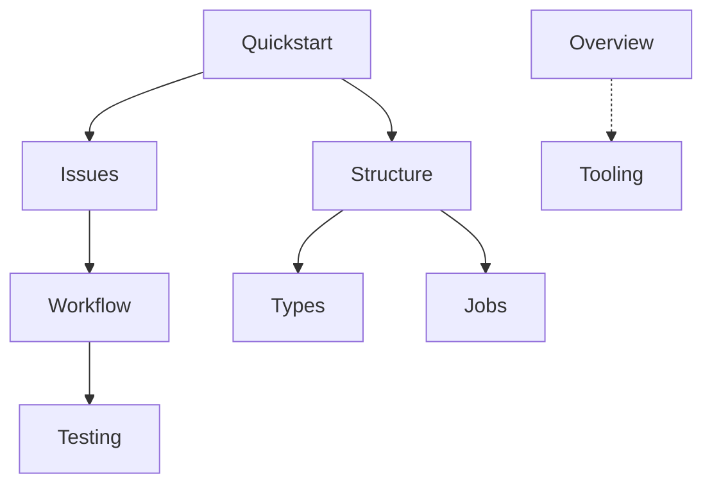

# Docs north star: deliverables for engineers

**Audience:** colleagues building the product. **Rule:** if a fact lives in tool docs, `package.json`, or the repo itself, link once, do not replicate. If a colleague would ask you in Slack, it earns a page (or a row in an artifact).

**Page shape:** opener (what this is) → deliverable (tree, table, steps, commands) → one bridge line. No product pitch, no history.

## Honest verdict per page

| Page | Verdict | Why it exists |
| --- | --- | --- |
| [index.mdx](/Users/paddy/www/docs/index.mdx) | **Fix now** | Still product copy. Should orient on stack + where to go. |
| [quickstart.mdx](/Users/paddy/www/docs/quickstart.mdx) | **Done** | Onboarding path. Keep all 8 Explore cards. |
| [method/issues.mdx](/Users/paddy/www/docs/method/issues.mdx) | **Done** | Issue creation bar. Nowhere else tells colleagues how agents file issues. |
| [method/workflow.mdx](/Users/paddy/www/docs/method/workflow.mdx) | **Done** | Spec-kit loop, three steer points. Pairs with Issues (issue in → spec out). |
| [method/testing.mdx](/Users/paddy/www/docs/method/testing.mdx) | **Done** | Commands + gate. The only place that lists what to run before push. |
| [architecture/structure.mdx](/Users/paddy/www/docs/architecture/structure.mdx) | **Slim now** | Monorepo tree. Over-explains MFE; slim, then stop. |
| [architecture/types.mdx](/Users/paddy/www/docs/architecture/types.mdx) | **Done** | Derive-don't-hand-write. Constitution material, not in Drizzle docs. |
| [architecture/jobs.mdx](/Users/paddy/www/docs/architecture/jobs.mdx) | **Done** | Canonical job shape + stances. Prevents the 60-jobs drift. |
| [stack/overview.mdx](/Users/paddy/www/docs/stack/overview.mdx) | **Done** | Tech inventory with rationale. Reference, not onboarding. |
| [stack/tooling.mdx](/Users/paddy/www/docs/stack/tooling.mdx) | **Done** | Agent workbench + Contract. MCP, commands, `AGENTS.md` rules. |

**Stop line:** no new pages, no more passes on Method, Testing, Types, Jobs, Overview, Tooling, or Quickstart until the mono repo ships and reality diverges.

**Deferred (not now):** product/core domain docs, SDK depth, auth page, Turborepo/shadcn rows in Overview, quickstart `turbo dev` / port 3024 until mono exists.

## Reading order for engineers



Quickstart gets the machine running. Method is the work loop (Issues → Workflow → Testing). Architecture is where code lives (Structure first, Types/Jobs when touching those layers). Stack is lookup.

## 1. Fix [index.mdx](/Users/paddy/www/docs/index.mdx)

**Frontmatter:** `description: "Turborepo monorepo, modular monolith, spec-driven."`

**Opener:**

```
A [Turborepo](https://turborepo.dev/docs/guides/frameworks/nextjs) monorepo, modular monolith in TypeScript. Two Next.js apps (`apps/web`, `apps/testing`) share `packages/ui` and a root `lib/` of Hono routers, Drizzle schemas, and Inngest jobs. [Spec-kit](https://github.com/github/spec-kit) drives every feature; this site is the constitution for structure, method, and stack.
```

**`## Navigate`:**

```
Start with [Quickstart](/quickstart), then [Structure](/architecture/structure) for the repo tree and [Method](/method/issues) for how work flows.
```

**Cards (4):** Quickstart, Structure, Issues, Overview (same copy as prior plan).

## 2. Slim [architecture/structure.mdx](/Users/paddy/www/docs/architecture/structure.mdx)

Microfrontends stays on this page only, not a separate page.

**Opener** (drop MFE sentence):

```
A [Turborepo](https://turborepo.dev/docs/guides/frameworks/nextjs) monorepo, modular monolith: two Next.js apps, one UI package, one domain layer in `lib/`. Each app is self-contained (own `proxy.ts`, own auth boundary).
```

**Repo tree** (simpler):

```text
apps/
  web/
    app/
    proxy.ts
    microfrontends.json   local dev routes /testing to testing
  testing/
    app/
    proxy.ts
packages/
  ui/                     shared shadcn components
lib/
  <module>/               router.ts, schema.ts, types.ts, jobs/, <domain>.ts
  shared/
specs/
.specify/
turbo.json
```

**One line after tree** (replaces current long paragraph):

```
Locally, [microfrontends](https://turborepo.dev/docs/guides/microfrontends) composes both apps on one URL; production routing is separate.
```

**App** and **Modules** sections: keep as-is.

## 3. Verify

- `npx mint validate` passes.
- Ten pages, no new pages, two edits only.
