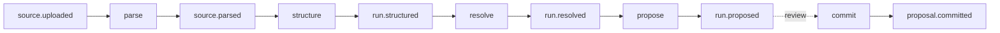

Everything asynchronous flows through one typed contract into Inngest. This is how the system stays idempotent, robust, and replayable, and how we keep control and overview at any stage.

## Contract

One function, `publish()`, validates every event against a zod registry and sends it to the bus. Inside a job, `step.sendEvent(buildEvent(...))` uses the same registry. Raw sends are forbidden, an invariant script fails the build on them.

Events are named `noun.verb`, past tense: `source.uploaded`, `run.structured`, `proposal.committed`.

## Anatomy

Every job has the same shape:

| Name | Description |
| --- | --- |
| Trigger | Exactly one event, or a cron |
| Shell | Thin Inngest function that delegates to a domain module |
| Concurrency | Keyed by org plus entity (source, run, connection), no cross-tenant races |
| Stance | One of the three idempotency stances below |
| Completion | Emits exactly one event when done |

## Stances

Pick one per job, write it in the spec:

| Name | Description |
| --- | --- |
| Recompute | Safe to re-run, rebuilds its output from persisted input |
| Keyed | Serialized per entity by the concurrency key, re-runs allowed |
| Re-runnable | Re-processing is the feature, like re-parsing a source |

## Replayability

A stage reads only the persisted output of the previous stage, never another job's memory. Re-running any stage creates a new run and re-emits its completion event, so everything downstream replays by construction. That is what control at any stage means: pick a point, re-run, the chain heals itself.

Non-fatal publishes get a backstop cron: if an event was swallowed, an hourly sweep re-queues the missing work.

## Pipeline

## Adding a job

- Define the event in the registry (zod schema, `noun.verb` name).
- Thin shell, fat domain module.
- Choose the concurrency key and the stance.
- Emit one completion event.
- Update the pipeline diagram on this page.
