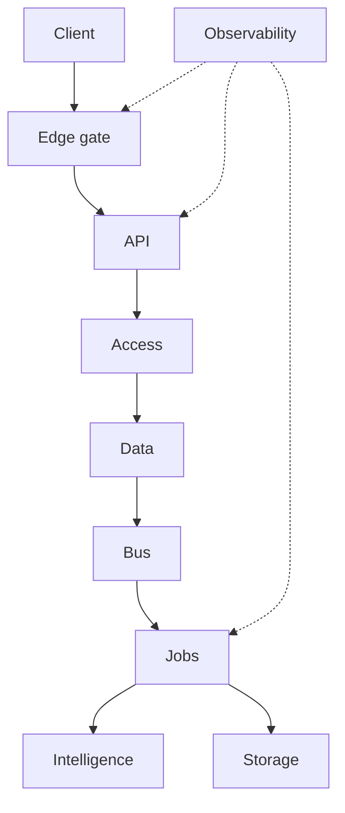

Bonafi is a modular monolith: one app, one deploy, hard module boundaries. This page is the map. The binding rules and checklists live on [Guardrails](/architecture/guardrails).

| Name | Description |
| --- | --- |
| [Structure](/architecture/guardrails#structure) | Domain modules in `lib/`, each owns its router, jobs, and tables |
| [Request](/architecture/guardrails#request) | Browser to response through one path, slow work publishes to the bus |
| [Access](/architecture/guardrails#access) | Session, tenant, permission, object. The edge never authorizes |
| [Data](/architecture/guardrails#data) | Tenant transactions, module-owned tables, truth through the commit path |
| [Events](/architecture/guardrails#events) | One typed publish contract, replayable at every stage |
| [Intelligence](/architecture/guardrails#intelligence) | Every model call through the gateway, tools in one registry |
| [Observability](/architecture/guardrails#observability) | One logger, request id from edge to job |

This is the kitchen. [Guardrails](/architecture/guardrails) has the rules. Feature specs are the recipes.
