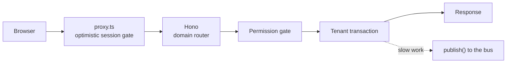

Every request follows one path. If a feature plan routes traffic differently, the plan is wrong.

| Name | Description |
| --- | --- |
| `proxy.ts` | Optimistic session gate, pages only, `/api` excluded. Redirects to login, never authorizes |
| Router | One Hono router per domain module, mounted on the `app/api/[[...route]]` catch-all |
| Session | Middleware reads the AuthKit session, sets user, org, and roles on the typed env |
| Permission | Every business route gates on a permission slug before touching data |
| Transaction | All reads and writes run inside a tenant-bound transaction with an explicit org predicate |

## Contract

A handler does four things, in order, and nothing else:

1. Validate input (zod).
2. Read or persist inside the tenant transaction.
3. `publish()` an event for anything slow.
4. Return.

Handlers never parse documents, never call models, never loop on external APIs. If it takes longer than a beat, it goes to the [bus](/architecture/events).

## Exempt

| Name | Description |
| --- | --- |
| `/api/inngest` | Bus delivery, signed by Inngest, no session |
| Webhooks | Server-to-server, HMAC-verified, no session |

## Adding a route

- Which domain router does it join?
- Which permission slug gates it?
- What does it publish, if anything?

If you cannot answer all three, the spec is not done.
