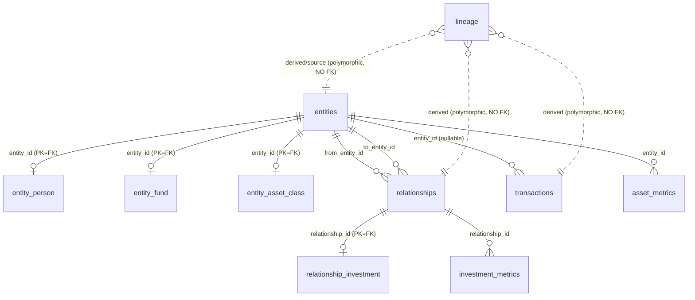

Truth is the canonical portfolio state. AI never writes truth directly. Exactly one function, `commitToTruth`, may write truth, and every committed value carries a `lineage` row back to the proposal and document it came from. The [extraction pipeline](/architecture/extraction-pipeline) produces proposals; truth emerges through this one gate.

## Split

| Name | Description |
| --- | --- |
| Proposals | Candidate facts. The only place AI may write. A proposal is a guess with evidence, not yet trusted. |
| Truth | The canonical portfolio state. AI can never write here directly. `commitToTruth` is the only writer. |
| Lineage | Provenance. Every committed truth value gets a `lineage` row pointing back to the proposal it came from. |

The payoff of the split:

| Name | Description |
| --- | --- |
| Safety boundary | AI can only reach proposals. A bug in a prompt creates noise in review, never silent corruption of truth. |
| Replayable substrate | Perception happens once. Meaning can be recomputed forever without re-reading the document. |
| Audit by construction | Truth rows are versioned, never overwritten, and every one has a `lineage` edge back to its evidence. |

## Gate

`commitToTruth` takes a typed `CommitInput`, writes the truth row, its `lineage` edge, and supersedes the source proposals in one transaction. The single-writer invariant is enforced at three independent layers:

| Layer | Mechanism | What it stops |
| --- | --- | --- |
| Architecture | AI code paths only ever write proposals. | A whole class of design mistakes. Nothing in extraction has a truth-write call to get wrong. |
| Code-time | A CI static check fails if any insert or update against a truth table appears outside the reconciler module. | A direct write sneaking into a feature branch. |
| Runtime | A Postgres trigger rejects any write unless `app.commit_source` is set to `reconciler` inside the same transaction. | Anything at all, including raw SQL or a migration that dodges layers one and two. |

`commitToTruth` is the only code that sets that GUC. Table columns and RLS live in `lib/<module>/schema.ts`, not duplicated here.

## Graph

Truth is a graph with append-only, versioned rows.

| Primitive | Table | Description |
| --- | --- | --- |
| Node | `entities` | A person, company, fund, trust, or asset. One table, `kind` is the label. Typed detail in `entity_person`, `entity_fund`, `entity_asset_class`. |
| Edge | `relationships` | A directed link `from_entity_id` to `to_entity_id`, labelled by `kind`. Typed detail for investments in `relationship_investment`. |
| Movement | `transactions` | A dated money movement, a capital call or distribution, attributable to a holding. |
| Measure | `asset_metrics`, `investment_metrics` | Stated measures over time, keyed on a node or an edge. |
| Provenance | `lineage` | The derivation edges that answer "how do we know?". |

### Diagram

Solid lines are enforced foreign keys. Dotted lines are polymorphic `(table, id)` pairs, not enforced, so one recursive walk covers any derivation. Every table is org-scoped via `organization_id` (RLS), omitted from the diagram.

All truth rows share a common spine:

| Column | Meaning |
| --- | --- |
| `organization_id` | The tenant. RLS-enforced; every truth row is scoped to one org. |
| `actor_kind`, `actor_id` | Who produced the row. `agent` is an LLM run, `user` is a human, `system` is a job or migration. |
| `trust_score` | A 0..1 confidence the value itself is right, derived from its lineage. |
| `superseded_by` | Versioning. A correction appends a new row and points the old one at it. |
| `retracted_at` | Tombstone. Truth is never destructively updated. |

## Classes

A truth class answers one question: what kind of truth is this fact, and which truth table does it become? The committable classes map one-to-one onto truth tables.

| Class | Table | Keyed on | Question |
| --- | --- | --- | --- |
| `entity` | `entities` | is the node | Who or what exists? |
| `relationship` | `relationships` | the edge | How are two nodes linked? |
| `transaction` | `transactions` | edge and entity | What money moved, and when? |
| `asset_metric` | `asset_metrics` | `entity_id`, one node | What is the thing itself worth? |
| `investment_metric` | `investment_metrics` | `relationship_id`, one edge | How is one holder's stake doing? |

`asset_metric` and `investment_metric` are both stated measures as of a date. They differ by what they attach to: `asset_metric` is arity one on a single node, `investment_metric` is arity two on the holder's `invests_in` edge. `transaction` is a directed, dated flow, not a stock.

<Callout type="warning">
Class is derived, never decided. Nothing labels a value as asset-metric, investment-metric, or transaction per cell. Once a header resolves to a canonical metric, the class is a lookup against the registry, an output of resolvement, not an input a reviewer or model picks.
</Callout>

### Fact

`proposal_target_kind` has a sixth member, `fact`, that is not committable. `commitToTruth` has no handler for it, and the truth-write static check fails CI if one is ever added. A `fact` proposal is kind-undecided: the extractor found a value but the reviewer must decide what it is before it can become truth. Resolving a `fact` always supersedes it with a typed proposal first.

### What goes where

- A noun that persists → `entities`, labelled by `kind`. A fund is `kind = 'asset'` with its specifics in `entity_asset_class`, not its own table.
- A link between two nouns → `relationships`, labelled by `kind` (`owns`, `directs`, `invests_in`).
- A dated money movement → `transactions`, not an entity, because it is a movement in time, not a thing that persists.

### Where amounts live

| Amount | Home |
| --- | --- |
| Static holding terms (commitment, principal, interest rate, term) | `relationship_investment`, keyed on the `invests_in` edge. |
| Movements in time (capital calls, distributions, interest, repayments) | `transactions`, keyed on the holding edge. |
| Metrics over time (NAV, FMV, WOZ, book value; position value, called/distributed to date, TVPI, IRR) | `asset_metrics` keyed on the asset node, or `investment_metrics` keyed on the holder's edge. |

## Tables

The truth tables and their design. Every table here is RLS-tenant-isolated and carries the reconciler-only write trigger (see [Gate](#gate)). Column types live in `lib/<module>/schema.ts`.

### `entities`

- Stores one node in the tenant's world: a person, company, trust, or asset. `kind` is open text and the label that distinguishes sorts of entity. The extractor uses a closed enum `['natural_person', 'company', 'trust', 'asset']`; every classified investment target is `asset`, with its specifics in `entity_asset_class`.
- Key columns: `display_name`, `attributes` (jsonb, open-ended stated facts), `trust_score`, `superseded_by`, `actor_kind`, `actor_id`, plus the shared spine.
- Class Table Inheritance: `entities` is a slim base holding identity and the shared columns, plus a typed detail table per high-value kind, keyed `PK = FK` on `entities.id`. The jsonb `attributes` bag is the escape hatch for the open long tail, so a new connector `kind` never forces a migration. Reading a person is `entities JOIN entity_person USING (id)`; the mixed-kind list and the ownership walk read only the base.
- Constraints: `trust_score` `CHECK (0..1)`; self-referencing `superseded_by` FK to `entities.id`.
- Indexes: `(organization_id, kind)`.
- Restrictions: RLS tenant isolation; reconciler-only writes (trigger).

#### `entity_person`, `entity_fund`, `entity_asset_class`

- Store typed columns a specific kind wants. `entity_person`: `date_of_birth`, `nationality`, `kyc_status`, `tax_residence`. `entity_fund`: `strategy`, `vintage_year`, `base_currency`, `nav`. `entity_asset_class`: the asset's classification (`asset_class_slug`, `level1_slug`) validated against the static registry. `entity_id` is both primary key and foreign key to `entities.id`.
- Typed columns get tight B-tree indexes, so high-selectivity queries (`kyc_status = 'pending'`) are O(log n) instead of a jsonb scan. `entity_person` promotion keys off `kind = 'natural_person'`; `entity_fund` promotion keys off the asset's classification matching `private_markets.funds.*`, not its kind. `commitToTruth` writes the base row and the matching detail row in the same transaction.
- Restrictions: RLS; reconciler-only writes (trigger); each is in the truth-write CI check's table list.

#### `relationship_investment`

- Stores investment-only monetary columns (`amount`, `currency`, `principal`) for `kind = 'invests_in'`. `relationship_id` is both primary key and foreign key to `relationships.id`. A holding's `interest_rate` and `term_months` are not here, they are investment metrics keyed on the same edge.
- `commitToTruth` writes the base relationship and the detail row in the same transaction.
- Restrictions: RLS; reconciler-only writes (trigger); in the truth-write CI check's table list.

### `relationships`

- Stores a directed, weighted edge between two `entities` rows. `from_entity_id` is the owner or director, `to_entity_id` is the owned or directed. `kind` is `owns`, `directs`, `invests_in`, or similar; `weight` is the ownership ratio (0..1).
- The org-chart and ownership graph, modelled relationally. Ownership questions ("who ultimately owns X?") are a recursive CTE over this table, no graph database.
- Constraints: `weight` and `trust_score` each `CHECK (0..1)`; `superseded_by` self-referencing FK.
- Indexes: `(organization_id, from_entity_id)` and `(organization_id, to_entity_id)`.
- Foreign keys: `from_entity_id`, `to_entity_id` → `entities.id`.
- Restrictions: RLS; reconciler-only writes (trigger).

### `transactions`

- Stores one booked or instructed movement. `amount` (absolute), `currency`, `direction` (`debit` or `credit`), `occurred_at`, optional `entity_id` (the subject), `trust_score`.
- `direction` plus absolute `amount`, matching how documents phrase movements. `direction` is plain text, not an enum, because connectors write it and may emit values beyond the two labels. `entity_id` is nullable because a movement may be extracted before its counterparty entity is resolved.
- Constraints: `trust_score` `CHECK (0..1)`; `superseded_by` self-referencing FK.
- Indexes: `(organization_id)` and `(organization_id, entity_id)`.
- Restrictions: RLS; reconciler-only writes (trigger).

### `asset_metrics`

- Stores a stated measure of the thing itself, independent of any holder. `entity_id` is a not-null foreign key to `entities.id` (the asset); there is no relationship column. `metric_type` is the measure type: `nav`, `fmv`, `woz`, `book`, `purchase`, plus fund-level `tvpi` and `irr`. `amount` and `as_of` are required; `currency` is nullable (null for ratio types).
- Keyed on the asset entity because a fund's NAV is the same NAV for every holder. Append-only with the standard supersede chain. Proposals target it via `proposal_target_kind = 'asset_metric'`.
- Indexes: `(organization_id, entity_id, metric_type, as_of desc)`.
- Restrictions: RLS; reconciler-only writes (trigger); in the truth-write CI check's table list.

### `investment_metrics`

- Stores a holder-specific measure of one stake, as stated by capital-account statements. `relationship_id` is a not-null foreign key to `relationships.id` (the holder's `invests_in` edge); the asset is derived via the relationship's `to_entity_id` and never duplicated onto the metric row. `metric_type` is one of `position_value`, `called_cumulative`, `uncalled_cumulative`, `distributed_cumulative`, `tvpi`, `irr`, `return_ytd_pct`, `portfolio_weight_pct`. `amount` and `as_of` are required; `currency` is nullable.
- Keyed on the edge because in a multi-family office several families hold the same pool, and per-family figures must never collide on one asset node. An `investment_metric` proposal cannot commit before the holder's `invests_in` relationship exists in truth; it holds as Blocked and retries once the relationship commits. Proposals target it via `proposal_target_kind = 'investment_metric'`. Append-only with the standard supersede chain.
- Indexes: `(organization_id, relationship_id, metric_type, as_of desc)`.
- Restrictions: RLS; reconciler-only writes (trigger); in the truth-write CI check's table list.

### `lineage`

- Stores a single provenance edge. Columns: `derived_table` and `derived_id` (the thing produced), `source_table` and `source_id` (what it came from), `derivation_kind` (why or how), `confidence`, `rationale`, `actor_kind`, `actor_id`.
- `lineage` is one uniform, append-only graph over heterogeneous node kinds, walked by a single recursive CTE. Typing it would fix only the stable derived end while the source end keeps growing, produce structurally identical duplicate tables, and break the uniform walk. The missing foreign key is mitigated by construction: only `commitToTruth` writes `lineage`, it validates both ends at write time, and truth and proposals are never deleted, so references cannot dangle.
- For the `reconciliation_commit` edge, `confidence` is `1.000`; the meaningful per-field confidence lives on the proposal.
- Constraints: `confidence` `CHECK (0..1)`.
- Indexes: `(derived_table, derived_id)` and `(source_table, source_id)`, the two directions the CTE traverses.
- Restrictions: RLS; reconciler-only writes (trigger).

## Provenance

The durable chain answers "how do we know this value?" by walking backwards:

| Step | Object |
| --- | --- |
| Truth row | `asset_metrics`, `investment_metrics`, `transactions`, `entities`, `relationships` |
| Lineage | `lineage` row |
| Proposal | `proposals` row |
| Inputs | `proposal_inputs` |
| Carrier | cell or freestanding value |
| Atom or label | `quantity_atoms`, `date_atoms`, `labels` |
| Geometry | table or page |
| Parse | `parses` artifact in R2 |
| Source | `sources` row, source file |

The walk is uniform: `lineage` is polymorphic on both ends, so one recursive CTE traverses supersession chains, merges, and manual overrides (see [`lineage`](#lineage)).

Pipeline rules: [Extraction](/architecture/extraction-pipeline). Persistence rules: [Database](/architecture/database).
