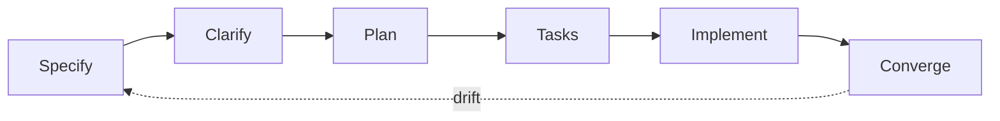

Workflow turns [beliefs](/concept/beliefs) into daily practice. Spec-kit provides the commands, this page defines how we use them.

## The loop



| Step | Command | Output |
| --- | --- | --- |
| Specify | `/speckit.specify` | What and why, no tech stack yet |
| Clarify | `/speckit.clarify` | Gaps closed before planning |
| Plan | `/speckit.plan` | Tech stack and architecture |
| Tasks | `/speckit.tasks` | Ordered, dependency-aware task list |
| Implement | `/speckit.implement` | Code and tests |
| Converge | `/speckit.converge` | Diff spec vs code, append remaining work |

Day 0 in the code repo: `specify init` runs before the first feature commit. `.specify/` and the slash commands are committed, so the spec loop is the path of least resistance.

This docs repo is the source of truth for rules. The code repo's `.specify/memory/constitution.md` mirrors [Rules](/concept/rules), updated in the same change.

## Gherkin and E2E binding

Every spec includes acceptance scenarios:

```gherkin
Scenario: investor sees committed capital balance
  Given a parsed capital account statement
  When the reviewer approves the ending balance proposal
  Then truth contains the committed metric for that investor
```

Each scenario gets a stable id (like `CAP-001`). One Playwright test per scenario, id in the test title, so coverage is greppable. Done means all scenario tests pass.

## How it sticks

1. `.specify/` is committed before feature work starts, structure over willpower.
2. The code repo's `AGENTS.md` requires a `specs/NNN-*/spec.md` before feature work. Missing spec, the agent runs `/speckit.specify` first.
3. CI gates: spec-reference check and scenario-coverage check, see [Testing](/concept/testing).
4. `/speckit.converge` catches drift after each feature ships.
5. `/speckit.taskstoissues` pushes tasks to Linear, every issue traces to a spec section.

## How we track work

Linear is linked with Cursor for everyone, an onboarding requirement, see [Quickstart](/quickstart).

| Phase | Motion |
| --- | --- |
| Capture | The agent files a Linear issue when work is identified: title, context, spec link |
| Execute | The agent works the issue spec-first, the human steers in review |
| Close | The PR links the issue, converge appends leftovers as new issues |

We move fast by creating issues through agents, not by context-switching to write tickets by hand.
