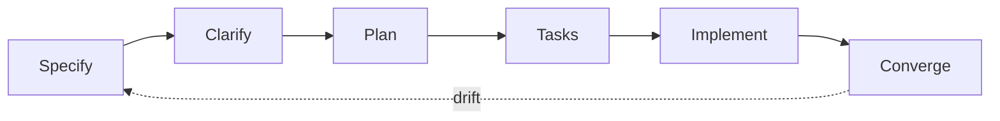

Spec-kit gives us the recipe format and the kitchen rules. The [architecture pages](/architecture/request) are our base techniques, every feature spec is a recipe written in that format, and nothing leaves the kitchen without passing the taste test (the scenario tests). This page is how the kitchen runs.

## Loop



| Name | Description |
| --- | --- |
| `/speckit.specify` | What and why, no tech stack. Creates the branch and `specs/NNN-name/` |
| `/speckit.clarify` | Closes gaps before planning, forced `[NEEDS CLARIFICATION]` markers |
| `/speckit.plan` | Tech stack and architecture, checked against the constitution and its gates |
| `/speckit.tasks` | Ordered task list, independent tasks marked `[P]` for parallel execution |
| `/speckit.implement` | Code and tests, refuses to run without spec, plan, and tasks |
| `/speckit.converge` | Diffs spec vs code after shipping, appends remaining work |

The agent runs these, not you. Prerequisites enforce the order.

## Paths

| Name | Description |
| --- | --- |
| Full loop | Features: new behavior, multi-file. The whole loop above |
| Light path | Fixes and tweaks: issue, branch, fix, PR. Existing scenarios cover the regression |

## Recipe

What a feature directory contains when the loop has run:

| Name | Description |
| --- | --- |
| `spec.md` | User stories and acceptance scenarios |
| `plan.md` | Tech choices with rationale, gate results |
| `research.md` | Library and approach comparisons |
| `data-model.md` | Entities and schema changes |
| `contracts/` | API and event contracts |
| `tasks.md` | The executable task list |

## Gates

`/speckit.plan` checks every plan against the constitution before tasks exist: simplicity (no future-proofing), anti-abstraction (use the framework directly), integration-first (contracts and real environments before code). Failing a gate demands written justification. Our project-defined articles point at the architecture pages, so [request](/architecture/request), [events](/architecture/events), and [structure](/architecture/structure) compliance is checked on every plan, and CI enforces the mechanical subset, see [Testing](/concept/testing).

## Scenarios

Every spec carries acceptance scenarios, each bound to one Playwright test:

```gherkin
Scenario: investor sees committed capital balance
  Given a parsed capital account statement
  When the reviewer approves the ending balance proposal
  Then truth contains the committed metric for that investor
```

Scenario id (like `CAP-001`) goes in the test title. Done means all scenario tests pass.

## Guardrails

The house rules, one line each, the wiring detail lives on the linked page:

- One tenant key everywhere: session claim = database key = permission object.
- Requests follow one path, slow work goes to the bus, see [Request](/architecture/request).
- Everything async through one publish contract, replayable at every stage, see [Events](/architecture/events).
- Modules own their tables, one folder truth, see [Structure](/architecture/structure).
- Exactly one big JSONB in the system: the raw parse artifact.
- Truth is written only through the commit path, with its decision record, in one transaction.
- All LLM calls through one gateway.

These bind in the code repo: spec-kit reads them from `.specify/memory/constitution.md`, CI enforces them as invariant scripts.

## Tracking

Linear is linked with Cursor for everyone, see [Quickstart](/quickstart).

| Name | Description |
| --- | --- |
| Capture | The agent files a Linear issue the moment work is identified |
| Execute | The agent works the issue spec-first, the human steers in review |
| Close | The PR links the issue, converge appends leftovers as new issues |

We move fast by creating issues through agents, not by writing tickets by hand.
