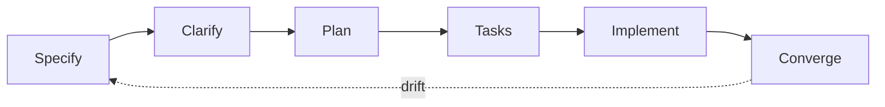

Two beliefs drive everything: we build the system that lets agents build the features, and specs plus end-to-end tests verify the behavior so nobody re-checks code by hand. This page is how that works day to day.

## Loop



| Name | Description |
| --- | --- |
| `/speckit.specify` | What and why, no tech stack yet |
| `/speckit.clarify` | Close gaps before planning |
| `/speckit.plan` | Tech stack and architecture |
| `/speckit.tasks` | Ordered, dependency-aware task list |
| `/speckit.implement` | Code and tests |
| `/speckit.converge` | Diff spec vs code, append remaining work |

Specs live in `specs/NNN-name/` in the code repo. No feature work without one, the agent runs `/speckit.specify` first if it is missing.

## Scenarios

Every spec carries acceptance scenarios, each bound to one Playwright test:

```gherkin
Scenario: investor sees committed capital balance
  Given a parsed capital account statement
  When the reviewer approves the ending balance proposal
  Then truth contains the committed metric for that investor
```

Scenario id (like `CAP-001`) goes in the test title. Done means all scenario tests pass.

## Guardrails

The invariants that are specific to us, one line each:

- One tenant key everywhere: session claim = database key = permission object.
- Exactly one big JSONB in the system: the raw parse artifact.
- Truth is written only through the commit path, with its decision record, in one transaction.
- Replay, never mutate: re-running a stage creates a new run.
- All LLM calls through one gateway, all slow work through the event bus.
- One parser seam, one object-store seam, vendors swappable behind them.

These bind in the code repo: spec-kit reads them from `.specify/memory/constitution.md`, CI enforces them as invariant scripts, see [Testing](/concept/testing). How the wiring, layering, and folder structure work is defined in the Architecture pages (coming) and per-feature specs.

## Tracking

Linear is linked with Cursor for everyone, see [Quickstart](/quickstart).

| Name | Description |
| --- | --- |
| Capture | The agent files a Linear issue the moment work is identified |
| Execute | The agent works the issue spec-first, the human steers in review |
| Close | The PR links the issue, converge appends leftovers as new issues |

We move fast by creating issues through agents, not by writing tickets by hand.
