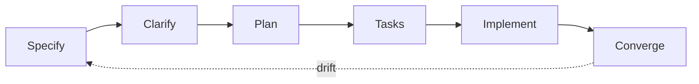

Workflow is the loop that turns [beliefs](/concept/beliefs) into daily practice. Spec-kit provides the commands; this page defines how we use them.

## The loop



| Step | Command | Output |
| --- | --- | --- |
| Specify | `/speckit.specify` | What and why — no tech stack yet |
| Clarify | `/speckit.clarify` | Gaps closed before planning |
| Plan | `/speckit.plan` | Tech stack and architecture |
| Tasks | `/speckit.tasks` | Ordered, dependency-aware task list |
| Implement | `/speckit.implement` | Code + tests |
| Converge | `/speckit.converge` | Diff spec vs code; append remaining work |

**Day 0 in the code repo:** run `specify init` before the first feature commit. Commit `.specify/` and the slash commands so the loop is the path of least resistance.

**Docs repo is SSOT for rules.** The code repo's `.specify/memory/constitution.md` mirrors [Rules](/concept/rules). Update both in the same change when rules change.

## Gherkin and E2E binding

Every spec includes acceptance scenarios:

```gherkin
Scenario: investor sees committed capital balance
  Given a parsed capital account statement
  When the reviewer approves the ending balance proposal
  Then truth contains the committed metric for that investor
```

Each scenario gets a stable id (e.g. `CAP-001`). One Playwright test per scenario; the id appears in the test title so coverage is greppable. Definition of done = all scenario tests pass.

## How it sticks

Mechanics, not willpower:

1. **Structural day 0** — `.specify/` is committed before feature work starts.
2. **Agent contract** — `AGENTS.md` in the code repo: no feature work without `specs/NNN-*/spec.md`. If missing, the agent runs `/speckit.specify` first.
3. **CI gates** — spec-reference check + scenario-coverage check. See [Testing](/concept/testing).
4. **Converge after ship** — `/speckit.converge` catches drift before the next feature.
5. **Tasks to Linear** — `/speckit.taskstoissues` pushes tasks; every issue traces to a spec section.
6. **Rules mirror sync** — hash check keeps `.specify/memory/constitution.md` aligned with docs.

## How we track work

Linear is linked with Cursor for everyone — an onboarding requirement, not a preference. See [Quickstart](/quickstart).

| Phase | Motion |
| --- | --- |
| Capture | Agent files a Linear issue when work is identified (title, context, spec link) |
| Execute | Agent works the issue spec-first; human steers in review |
| Close | PR links the issue; converge appends leftovers as new issues |

This is our default: move fast by creating issues through agents, not by context-switching to write tickets by hand.
