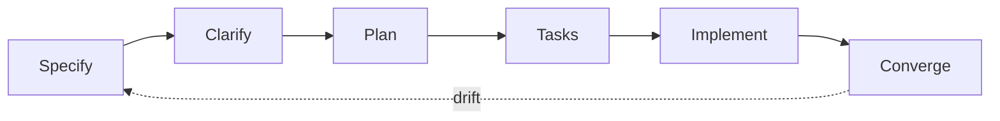

Features are built spec-first: the agent runs the [spec-kit](https://github.com/github/spec-kit) loop, every artifact lands in `specs/NNN-name/`. We do not replicate the tool's docs, this page is only what you act on.



## Your job

<Steps>
  <Step title="Describe">
    Give the agent what and why in behavior terms, no tech stack. Every scenario binds to one test by its id (like `CAP-001`):

    ```gherkin
    Scenario: investor sees committed capital balance
      Given a parsed capital account statement
      When the reviewer approves the ending balance proposal
      Then truth contains the committed metric for that investor
    ```

    Success: the scenarios in `spec.md` cover what you meant, nothing invented.
  </Step>
  <Step title="Answer">
    The agent asks clarify questions before planning, answer them, then review the plan.

    Success: no `[NEEDS CLARIFICATION]` left, no components you did not ask for. Agents are over-eager, catching that is your job.
  </Step>
  <Step title="Review">
    The PR.

    Success: every scenario test green, converge leftovers filed as Linear issues.
  </Step>
</Steps>

## Path

Features take the full loop above. Fixes and tweaks take the light path: issue, branch, fix, PR, existing scenarios cover the regression.

## Constitution

The one artifact that binds us: `.specify/memory/constitution.md` in the code repo matches the [architecture pages](/architecture/structure). The agent checks every plan against it, CI enforces the mechanical subset, see [Testing](/method/testing).

## Tracking

Linear is linked with Cursor for everyone, see [Quickstart](/quickstart).

| Name | Description |
| --- | --- |
| Capture | The agent files a Linear issue the moment work is identified |
| Execute | The agent works the issue spec-first, the human steers in review |
| Close | The PR links the issue, converge appends leftovers as new issues |

We move fast by creating issues through agents, not by writing tickets by hand.
